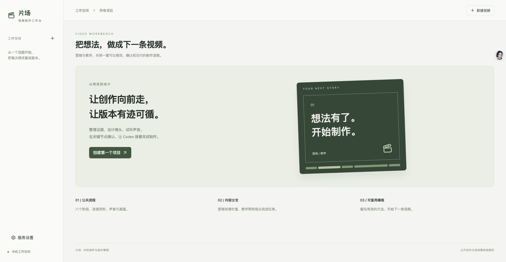
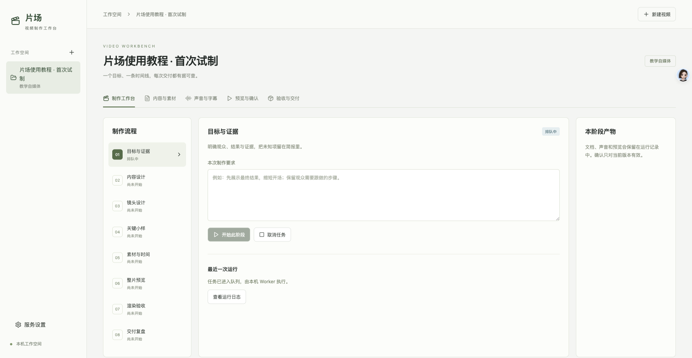
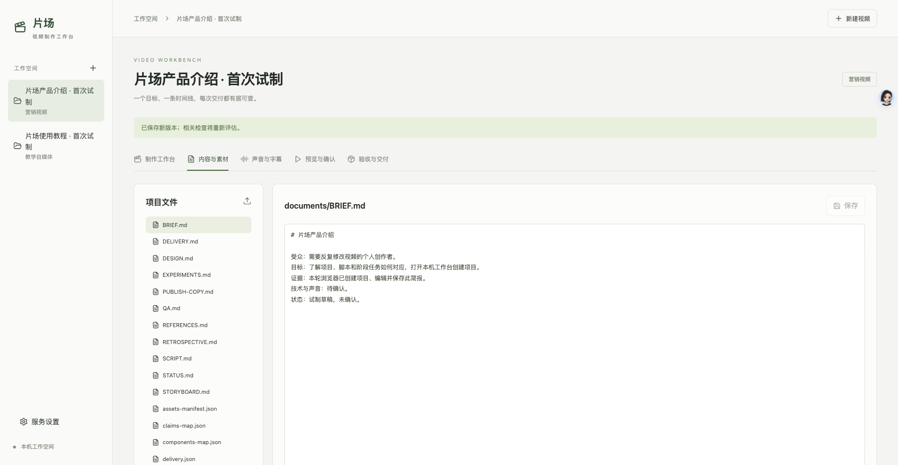
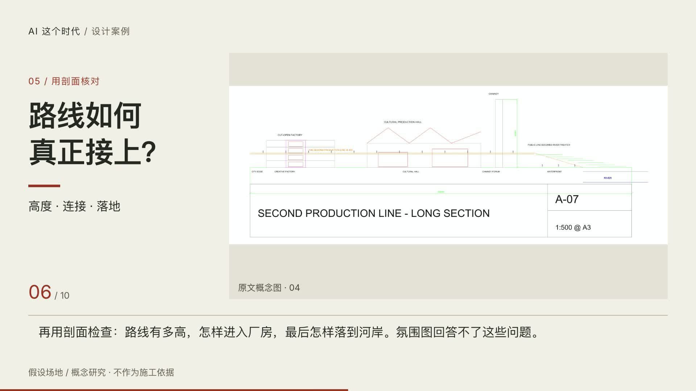

# 我用 Codex 搭了一个视频工作台：从公众号文章，到可以反复修改的成片

我原本只是想做一件事：把一篇公众号文章变成视频。

文章已经写好，素材也放在本地。让 AI 改成旁白，生成声音，再配上画面，似乎就能完成。

真正开始以后才发现，难点不在第一次导出 MP4，而在后面的修改和确认：

旁白改了一句，字幕和镜头时间要不要跟着更新？视频重新编码后，原来的检查报告还算不算数？看过几个版本后，最后确认的到底是哪一版？

所以，这次我没有停在“一键生成视频”，而是用 Codex 搭了一个本机视频制作工作台，叫作「片场」。

它把文章、脚本、声音、画面、检查记录和交付版本放到同一个项目里。目标很具体：**让一条视频可以继续修改，也让每次交付有据可查。**

*图 1｜片场首页：从一个选题开始，把每次修改留成版本。*

## 一套公共流程，两个内容分支

「片场」采用的结构是：

**一套公共制作流程、两个内容分支、一组可复用模板。**

营销视频和教学视频，共用资料整理、声音生成、画面制作、检查与交付流程，但内容组织不同。

营销视频围绕一个核心收益展开：

> 用户遇到什么问题 → 产品怎样解决 → 有什么成果证据 → 下一步做什么。

教学视频则围绕观众能否学会展开：

> 要解决什么问题 → 为什么这样做 → 怎样跟着完成 → 如何检查结果。

这个区别会直接影响制作。

营销片可以压缩操作过程，把注意力放在收益和证据上；教学片则需要交代前置条件、操作起点、预期结果，以及出错时该检查哪里。

同一个工具，介绍“它能做什么”和教会别人“怎样用它”，不应该只是换一份旁白。

*图 2｜首次试制时的工作台截图：左侧是八阶段流程，中间执行任务，右侧查看阶段产物。图中状态为截图时的历史状态。*

## 五种工具，各自负责一段

工作台没有让一个模型包办所有事情，而是把任务拆开：

| 工具 | 负责什么 |
|---|---|
| Codex | 整理资料、写脚本、设计分镜、维护工程和处理修改 |
| 本地 Qwen TTS | 按确认后的文本生成旁白 |
| 字幕与对齐模块 | 导入、校正字幕，维护时间信息 |
| HyperFrames | 编排画面、文字、动画和声音 |
| FFmpeg 与检查脚本 | 检查编码、分辨率、响度、峰值和关键帧 |

平台本身负责项目、任务、文件和确认记录。

这样分工后，声音需要调整，就回到声音环节；画面需要修改，就处理对应镜头。每次变更都能找到受影响的文件，不必重新猜一遍整条视频是怎样做出来的。

## 先把决定写下来，再开始生成

以前，很多制作决定只留在对话里。

这条视频给谁看？哪些信息有来源？哪些画面只是示意？标题答应了什么？观众最后应该做什么？

聊天结束后，这些决定很容易散掉。

现在，每个项目都会留下几份核心文件：

- `BRIEF.md`：受众、目标、发布渠道与内容边界。
- `SCRIPT.md`：旁白、屏幕文字和段落目标。
- `STORYBOARD.md`：镜头、动作、转场与时间安排。
- `DESIGN.md`：字体、颜色、布局和动效规则。
- 证据与素材清单：记录来源、用途和版本。

*图 3｜内容与素材页面：把简报、脚本、设计规范和检查记录留在项目里，修改后重新评估相关检查。*

我还把公共约束写进 `AGENTS.md`，把编排、营销、教学、旁白和交付检查分别做成项目内的 Skills。

它们的作用，是让 Codex 接手下一次修改时，能够读到之前的决定。

例如，“自动检查通过”不能写成“人已经确认”，“没有学习者参与测试”不能写成“已经验证教学效果”。这些边界需要留在工程里，而不只是口头提醒。

## 用一篇真实文章跑完整条链路

第一次实际制作，我选了一篇关于 AI 设计的公众号文章，改编成教学自媒体视频。

制作过程依次经过资料整理、脚本、分镜、声音、时间编排、预览和技术检查。

*图 4｜修订版成片的实际抽帧：标题、原文概念图与旁白字幕围绕同一个问题组织。画面中的设计内容属于假设场地与概念研究，不作为施工依据。*

第一版做出来后，一个问题很明显：**每换一页，都会有一次停顿。**

单独看每个段落没有问题，连起来却像在翻幻灯片。

检查后发现，分段音频的首尾留白，加上额外预留的镜头间隔，累积成了一次次不必要的停顿。后续版本修整了这些空白，并重新调整字幕和镜头时间。

视频从约 103.68 秒缩短到 87.23 秒。

这次修改让我更明确了一件事：每一段单独成立，并不代表整条视频连贯。分段生成之后，还需要站在观众的角度看完整片。

## 能播放，不代表已经测对

工作台接通以后，我又遇到了几个比视频生成更具体的问题。

第一个是：播放器有声音，时间也在走，但看不到画面。

最初测试只检查了播放状态和进度，没有逐帧核对实际显示。这种测试会给出一个误导性的结论——“播放正常”。

后来通过内置浏览器截图，才确认显示区域确实为空白。调整为通过 Canvas 绘制实际解码帧后，再检查首帧、中段、暂停跳转和片尾，画面才得到真正验证。

第二个是：“重新检查”按钮被流程拦住了。

已有成片只需要重新做技术检查，平台却把它当成首次渲染，要求先有预览确认记录。对于通过自动化脚本生成、后来登记到平台的文件，这个前置条件会让流程卡住。

修复后，已有视频可以独立复检，但技术检查通过仍然不等于人工验收通过。

第三个是：工作空间会自己来回切换。

原因是切换项目之后，旧项目尚未完成的请求仍会返回，并覆盖当前页面。后来给请求增加了项目与版本约束，只允许当前选择对应的最新结果更新页面。

这些问题提醒我：**视频生产线既要检查成片，也要检查人怎样操作这条生产线。**

按钮存在、任务能启动、接口没有报错，都只是验证的一部分。

## 验收必须对应具体文件

目前，这条修订版视频的技术检查结果包括：

- 分辨率：1920 × 1080。
- 帧率：30fps。
- 时长：约 87.23 秒。
- 视频与音频编码：H.264、AAC。
- 音频：48kHz、双声道。
- 综合响度：-18.01 LUFS。
- 真峰值：-2.01 dBTP。

这些是本项目的实际参数，不是所有视频都应该照搬的标准。

检查报告还会记录最终文件的 SHA-256。文件变化以后，旧报告不能继续作为新版本的证明。

但技术验收也有边界。

它能检查编码、响度和尺寸，却不能替人判断旁白是否自然、表达是否准确、教学步骤是否容易跟随。当前的技术检查通过，也不代表已经验证了观众的学习效果。

所以，工作台保留了“确认此版本”的人工入口，把技术结果与人的判断分别记录。

## 我希望留下的是一套可以继续用的方法

现在，「片场」的源码、项目 Skills、模板和文档已经提交到 GitHub 私有仓库。本地数据库、个人素材、音频和成片仍保存在本机。

它已经能支撑真实文章改编与视频复检，但还需要通过更多选题检验模板的适用范围。

对我来说，这次最有价值的结果，是下一条视频终于有了一个明确的起点：

先确定受众和目标，再整理证据；先试声音，再锁定时间；先看完整预览，再检查最终文件；修改以后，重新验证受影响的部分。

Codex 负责把这些环节连接起来，人负责判断内容是否值得讲、表达是否清楚，以及这一版能不能交付。

当这些决定都能留下来，下一次制作就不必从头解释，也不必从头猜。

**GitHub 项目地址：** [liuqing0224/video-workbench](https://github.com/liuqing0224/video-workbench)

*仓库目前为私有，仅获授权的账号可以访问。*
