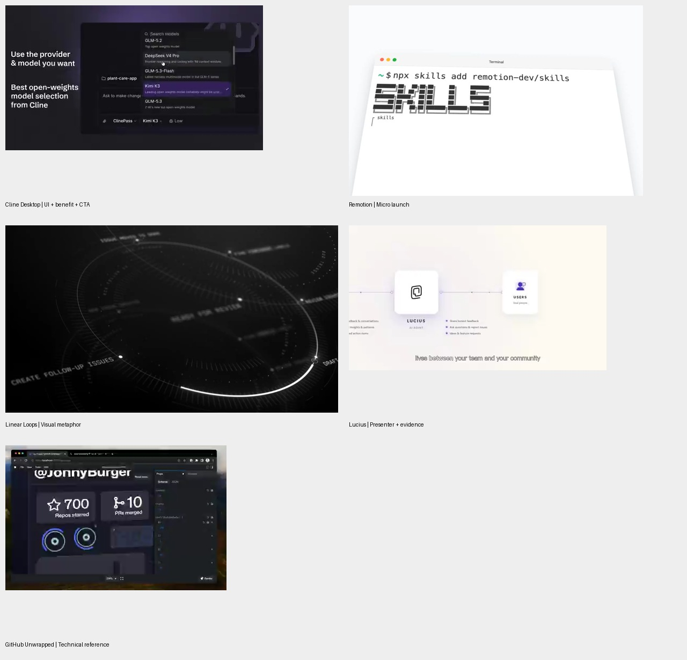

# 营销样片案例库

更新：2026-09-17。

执行入口：[营销视频制作工作流 v2](营销视频制作工作流.md)。案例库保留观察证据和适用边界，制作顺序、声音分支、确认节点与验收要求以该工作流为准。

本轮新增 4 个营销/发布样片和 1 个补充技术案例；与此前 Qoder 样片合计 6 个参考。新增案例实际查看 73 个采样画面，均保留原帖、播放器时长、独立帧和联系表。未直接听辨音频，不能据此评价配乐、卡点或旁白表现。时间段按采样归纳，非精确剪辑点。

“值得参考”指有可复用的叙事或设计方法，不代表已经证明转化效果。原片数字和效果主张不自动成为我们产品的事实。

## 选择与比较

| 案例 | 时长约 | 方法 | 适合用途 | 迁移成本判断 |
|---|---:|---|---|---|
| [Cline Desktop](references/cline-desktop/案例拆解.md) | 32.52 秒 | 功能短标题 + UI 证据 + 明确入口 | SaaS、桌面应用、版本更新 | 中：需要清楚的界面素材和焦点设计 |
| [Remotion Agent Skills](references/remotion-skills/案例拆解.md) | 8.09 秒 | 一次操作 + 一句发布信息 + 品牌组合 | 插件、工具、新功能通知 | 低：终端、文字与窗口动效 |
| [Linear Loops](references/linear-loops/案例拆解.md) | 40.45 秒 | 一个视觉母题贯穿到品牌图形 | 抽象能力、自动化、系统品牌发布 | 中高：需要图形、视角与连续性设计 |
| [Lucius](references/lucius/案例拆解.md) | 144 秒 | 人物讲解 + 原理图 + 产品证据 | 企业产品介绍、销售讲解 | 中高：真人素材、较长脚本与证据整理 |
| [GitHub Unwrapped 参数演示](references/github-unwrapped/案例拆解.md) | 38.15 秒 | 数据与模板分离，个性化输出 | 年度回顾、客户成果报告 | 中：数据验证与边界布局 |
| [Qoder 跨端任务](references/qoder/样片设计拆解.md) | 33.95 秒 | 同一任务贯穿设备与成果 | 跨端产品、任务型 AI 产品 | 中高：设备姿态与屏幕连续性 |

成本是针对本地 Qwen + HyperFrames 工作流的估计，不是原片预算。

## 本轮视觉证据

- [Cline 17 帧](references/cline-desktop/contact-sheet.jpg)
- [Remotion 9 帧](references/remotion-skills/contact-sheet.jpg)
- [Linear 15 帧](references/linear-loops/contact-sheet.jpg)
- [Lucius 18 帧](references/lucius/contact-sheet.jpg)
- [GitHub Unwrapped 14 帧](references/github-unwrapped/contact-sheet.jpg)

## 对生产线的改进

1. 先判断营销任务，再选样片：发布通知、产品演示、概念解释、信任建立、成果分享各有不同结构。
2. 单条视频确定一个主参考；第二参考只借一种辅助方法，例如标题排版或成果展示，避免风格拼贴。
3. 产品演示必须将每句主卖点对应到操作、结果或可核实证据；概念片则另配演示材料。
4. 小样验证最难的表达：跨端交接、环路隐喻、标题与 UI 对齐、人物与证据切换，或数据替换。
5. 本地 Qwen 是旁白能力，不强制所有视频使用旁白。短发布片可以只用文字；真人片不能直接替换可见讲话者的声音而忽略口型。
6. 动效服务于产品承诺，但不能用加速和动画伪造实际性能。展示值和等待时间要有依据。
7. 横竖版分别检验焦点、字号、设备边缘和行动入口。小屏可读性优先于复刻原片复杂度。
8. 保存“原片事实—设计解读—本项目建议”三层记录，后续不把推断变成来源事实。

## 推荐落地顺序

先建立 Cline 式“标题 + UI + CTA”基础模板；第二个模板做 Qoder 式任务链；第三个加入 Remotion 式短发布变体。等这些经过真实项目验收，再投入 Linear 式品牌概念片和 Lucius 式长讲解。GitHub Unwrapped 的参数化思路贯穿模板建设，用于提高版本复用效率。

## 搜索记录与排除理由

本轮通过公开搜索找到 What Ships、Impractical 等索引，再进入原始 X 帖查看视频。索引只用于发现，不代替样片证据。

- [What Ships：Linear Loops](https://www.whatships.com/videos/linear-loops/)
- [What Ships：Cline Desktop](https://www.whatships.com/videos/cline-desktop/)
- [Raycast 候选索引](https://impractical.ai/launch-videos/raycast-its-out)：本轮未查看其视频，不纳入已拆解案例。
- GitHub Unwrapped 查看后发现为操作演示，保留为技术参考，不包装成完整广告样片。

各案例目录的 source.json 保留原始链接与读取时的帖子信息；互动数字仅作来源快照，不用于效果排名。
